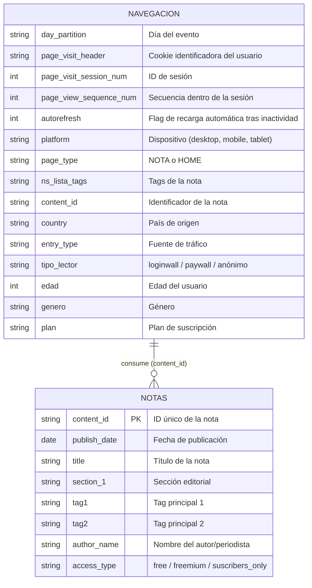

# 📊 Portal Analytics & Business Intelligence Challenge

Análisis integral de telemetría digital, comportamiento de lectura y patrones de conversión para un portal de noticias digital (prensa/medios). El proyecto analiza la navegación de lectores, segmenta audiencias (**Anónimos**, **Registrados** y **Suscriptores**), evalúa el impacto de paywalls/loginwalls y plantea recomendaciones estratégicas de negocio y producto.

---

## 🎯 Objetivos del Proyecto

1. **Entendimiento de Audiencias**: Caracterizar demográfica y comportamentalmente a los 3 arquetipos de usuarios (Anónimos, Registrados y Suscriptores con planes de pago).
2. **Hábitos de Lectura y Engagement**: Medir frecuencia de visitas, profundidad de sesión (pageviews por sesión), plataformas/dispositivos predilectos, y recurrencia mensual.
3. **Consumo de Contenidos y Paywall**: Analizar la interacción con notas de acceso abierto (*free*), intermedio (*freemium*) y restringido (*subscribers_only*), así como el efecto del *autorefresh*.
4. **Análisis Estratégico de Negocio & Producto**:
   - **Embudo de Conversión (Funnel Path)**: Tránsito de anónimo a registrado y a suscriptor de pago.
   - **Bouncers vs. Power Readers**: Calidad y lealtad según el canal de tráfico (Search, Directo, Redes Sociales, Referrals).
   - **Curva de Pareto Periodística**: Concentración de lecturas en firmas y autores destacados.
5. **Propuesta de Data Product**: Planteo de un sistema de recomendación personalizado de contenidos freemium/premium para usuarios registrados, maximizando la propensión de suscripción.

---

## 🗄️ Modelo de Datos

La base de datos relacional SQLite (`base_portal.db`) contiene dos tablas principales:



---

## 📁 Estructura del Repositorio

```text
├── base_portal.db           # Base de datos SQLite con tablas 'navegacion' y 'notas'
├── portal_analytics_bi.csv  # Dataset procesado para tableros de Business Intelligence / reporting
├── portal_challenge.ipynb   # Jupyter Notebook interactivo con EDA, métricas y visualizaciones
├── .gitignore               # Configuración de exclusiones Git
└── README.md                # Documentación del proyecto
```

---

## 💡 Hallazgos Destacados

- **Segmentación de Lectores**:
  - **Suscriptores**: Mayor lealtad, consumo diversificado en secciones de opinión, economía y política; hábito matutino marcado y recurrencia diaria.
  - **Registrados**: Representan la antesala natural a la suscripción; impactan con frecuencia contra notas de acceso restringido, lo que señala alta intención de lectura.
  - **Anónimos**: Representan el volumen bruto de tráfico, fuertemente condicionado por canales externos y tráfico móvil, con mayor rebote en notas de último momento.
- **Efecto Autorefresh**: Se cuantifica la distorsión del autorefresh (5 min de inactividad) especialmente en la página de *HOME*, limpiando métricas para evitar sobrestimación de lectura activa.
- **Concentración Editorial (Pareto 80/20)**: Un pequeño porcentaje de periodistas y notas editoriales genera la gran mayoría de las suscripciones e impacto paywall.

---

## 🚀 Cómo Ejecutar el Proyecto

### Requisitos Previos
- Python 3.10 o superior
- Jupyter Notebook / JupyterLab

### Instalación
1. Clona este repositorio:
   ```bash
   git clone https://github.com/Nicocarello/portal-analytics.git
   cd portal-analytics
   ```

2. Instala las librerías necesarias:
   ```bash
   pip install pandas numpy matplotlib seaborn sqlite3
   ```

3. Inicia el servidor de notebooks:
   ```bash
   jupyter notebook portal_challenge.ipynb
   ```

---

## 🔮 Roadmap / Trabajo Futuro

- [ ] **Modelo de Machine Learning para Propensión de Suscripción**: Clasificador supervisado (LightGBM/XGBoost) para predecir qué usuarios registrados tienen mayor probabilidad de contratar un plan.
- [ ] **Motor de Recomendación de Contenidos**: Algoritmo híbrido (filtrado colaborativo + TF-IDF de tags y secciones) para personalizar el feed de notas freemium para registrados.
- [ ] **Dashboard Interactivo**: Conectar `portal_analytics_bi.csv` con Power BI o Tableau para monitoreo de KPIs editoriales en tiempo real.
